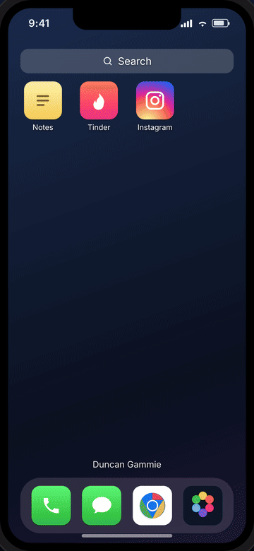
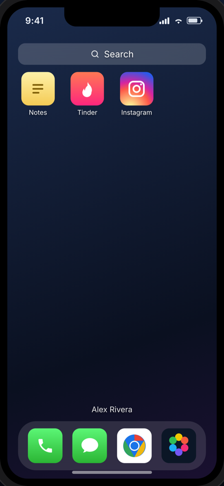
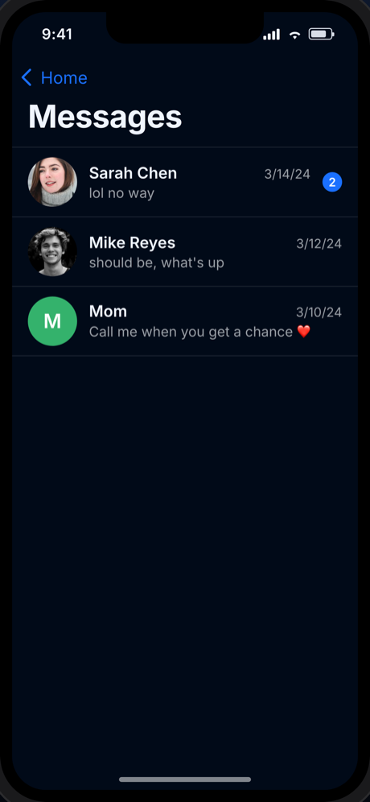
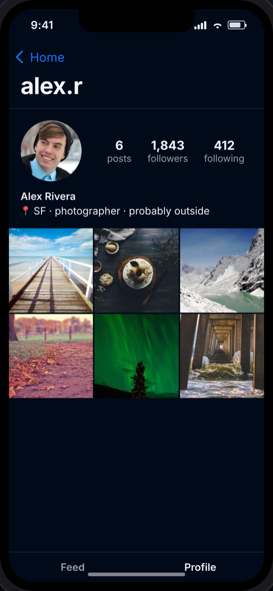
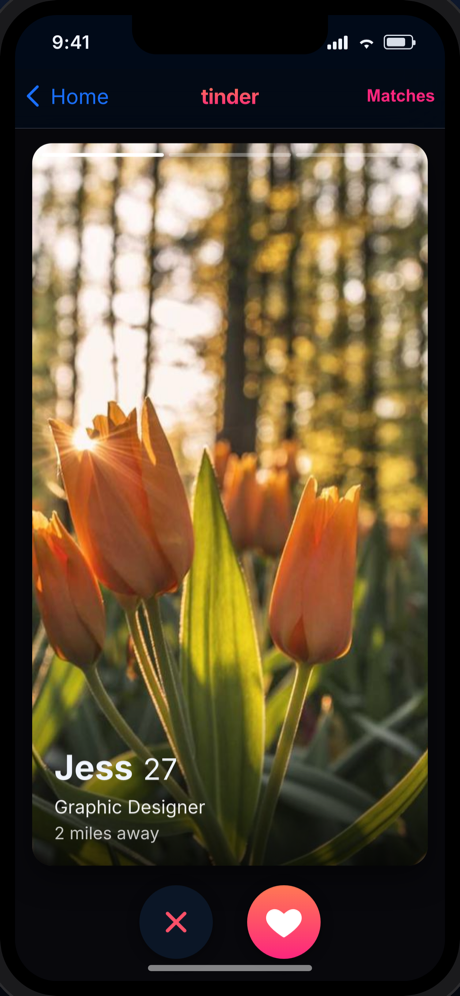

# phone-ui

Render realistic, **data-driven phone emulations** as React components. Drop in your own data and get a believable phone with working app screens — Messages, Photos, Notes, Phone/Calls, Browser history, Podcast, Tinder, and Instagram.

Great for storytelling sites, interactive fiction, ARGs, product mockups, design comps, and demos.

**[▶ Live demo](https://gammieduncan.github.io/phone-ui/)** · [npm](https://www.npmjs.com/package/@gammieduncan/phone-ui)

<p align="center">
  
</p>
<p align="center">
  <em><a href="./docs/demo.mp4">▶ watch the MP4</a> · or try the <a href="https://gammieduncan.github.io/phone-ui/">live demo</a></em>
</p>
<p align="center">
  
  
  
  
</p>

```tsx
import { Phone } from "@gammieduncan/phone-ui";
import "@gammieduncan/phone-ui/styles.css";

<Phone
  owner={{ name: "Duncan Gammie" }}
  wallpaper="linear-gradient(160deg,#1a2a4a,#0a1020)"
  apps={{
    messages: { chats: [...] },
    photos:   { photos: [...] },
    notes:    { notes: [...] },
    calls:    { calls: [...] },
    browser:  { engine: "Chrome", history: [...] },
    podcast:  { feedUrl: "https://feed.podbean.com/yourshow/feed.xml" },
    tinder:   { deck: [...], matches: [...] },
    instagram:{ profile: {...}, posts: [...], feed: [...] },
  }}
/>;
```

Only the apps you provide data for appear on the home screen. Tap an icon to open an app; each app has its own internal navigation (thread view, photo detail, post detail, swipe deck…), and the back button returns home.

## Install

```bash
npm install @gammieduncan/phone-ui
# peer deps: react >=18, react-dom >=18
```

## Apps & data shapes

Every app is fully typed. Import the types you need:

| App | Prop | Key types |
| --- | --- | --- |
| Messages | `messages` | `ChatThread`, `Message` |
| Photos | `photos` | `Photo` |
| Notes | `notes` | `Note` |
| Phone / Calls | `calls` | `CallRecord` |
| Browser history | `browser` | `BrowserVisit` |
| Podcast | `podcast` | `PodcastData`, `PodcastEpisode` |
| Tinder | `tinder` | `TinderProfile`, `TinderMatch` |
| Instagram | `instagram` | `IgAccount`, `IgPost`, `IgComment` |

See [`src/types.ts`](./src/types.ts) for the full schema, and [`src/demo/sampleData.ts`](./src/demo/sampleData.ts) for a complete worked example.

### Podcast: RSS or static

The Podcast app can be driven two ways. Easiest is a **podcast RSS feed** — the app fetches it at runtime and parses the show title, artwork, description, and every episode (with a streaming audio player):

```tsx
podcast: { feedUrl: "https://feed.podbean.com/yourshow/feed.xml" }
```

The feed host must allow cross-origin requests (`Access-Control-Allow-Origin`); most podcast hosts, including Podbean, do. Or pass **static episodes** (no network):

```tsx
podcast: {
  showName: "my show",
  artwork: "/cover.jpg",
  episodes: [
    { id: "1", title: "Episode 1", audioUrl: "/ep1.mp3", durationSeconds: 2795 },
  ],
}
```

### Loading your own data

There are three ways to get your content onto the phone — pick whichever fits.

**1. Pass it as props (in code).** This is the primary API. Build the object in your app and hand it to `<Phone>`:

```tsx
import { Phone } from "@gammieduncan/phone-ui";
import myData from "./my-phone.json";

<Phone apps={myData.apps} owner={myData.owner} wallpaper={myData.wallpaper} />;
```

**2. Parse a JSON file with the built-in loader.** A `.json` file is the easiest format to hand-author. Validate + load it with `parsePhoneData`, which accepts a string or parsed object and throws a readable error on bad input:

```tsx
import { Phone, parsePhoneData } from "@gammieduncan/phone-ui";

const data = parsePhoneData(await fetch("/my-phone.json").then((r) => r.text()));
<Phone {...data} />;
```

The file is a single object — see the ready-to-edit **[`examples/phone-data.json`](./examples/phone-data.json)**:

```json
{
  "owner": { "name": "Duncan Gammie" },
  "wallpaper": "linear-gradient(160deg,#1a2a4a,#0a1020)",
  "statusTime": "9:41",
  "apps": {
    "messages": { "chats": [ ... ] },
    "notes": { "notes": [ ... ] },
    "instagram": { "profile": { ... }, "posts": [ ... ] }
  }
}
```

A bare `apps` object (without the `owner`/`wallpaper` wrapper) is also accepted.

**3. Upload it in the playground.** Run `npm run dev` and use the **Upload data (.json)** button (with **Download template** to grab a starter file). Good for quickly previewing content without touching code.

> **Cloned the repo?** The demo's sample content lives in [`src/demo/sampleData.ts`](./src/demo/sampleData.ts) — edit that to change what `npm run dev` shows, or just upload your JSON. For your own project, install the package and use option 1 or 2 above.

### Changing the wallpaper

The `wallpaper` prop takes **either** an image URL **or** any CSS `background` value:

```tsx
<Phone wallpaper="https://example.com/bg.jpg" apps={...} />          // remote image
<Phone wallpaper="/wallpaper.jpg" apps={...} />                       // local file in /public
<Phone wallpaper="linear-gradient(160deg,#1a2a4a,#0a1020)" apps={...} /> // CSS gradient
```

For a local image in a cloned repo or Vite app, drop the file in `public/` and reference it by path (e.g. `/wallpaper.jpg`). In JSON data, set the same string on the top-level `"wallpaper"` field.

## `<Phone>` props

| Prop | Type | Description |
| --- | --- | --- |
| `apps` | `PhoneApps` | Per-app data. Apps without data are hidden. |
| `owner` | `{ name, avatar? }` | Shown on the home screen. |
| `wallpaper` | `string` | Image URL **or** any CSS background (e.g. a gradient). |
| `statusTime` | `string` | Status-bar clock. Default `"9:41"`. |
| `grid` | `AppId[]` | Which apps appear on the home grid, in order. See below. |
| `dock` | `AppId[]` | Which apps appear in the bottom dock, in order (max 4). |
| `initialApp` | `AppId` | Open straight into an app. |
| `initialSearch` | `string` | Open Spotlight search on mount, pre-filled with this query. |
| `frameless` | `boolean` | Render the screen without the device bezel. |
| `className` | `string` | Extra class on the root. |

`AppId` is one of: `"messages" | "photos" | "notes" | "calls" | "browser" | "tinder" | "instagram"`.

### Choosing & arranging apps

By default, every app you pass data for is shown — a sensible set in the dock (Phone, Messages, Browser, Photos) and the rest on the grid. To take control, use `grid` and `dock`:

```tsx
<Phone
  apps={myData}
  // home grid, left-to-right / top-to-bottom:
  grid={["messages", "instagram", "tinder", "notes"]}
  // bottom dock, left-to-right:
  dock={["calls", "photos"]}
/>;
```

- **Pick which apps are available:** only apps listed in `grid` or `dock` are shown. Anything you omit is hidden — even if you passed its data. (Pass neither prop to show everything.)
- **Place them:** order within each list is the on-screen order. Listing an app in `grid` keeps it off the default dock.
- An app still needs data to appear; listing an empty app does nothing.

## Theming

All visuals are driven by CSS custom properties scoped to `.pui-root`. Override any token to reskin (e.g. a light theme):

```css
.pui-root {
  --pui-bg: #ffffff;
  --pui-text: #111;
  --pui-blue: #0a84ff;
}
```

Full token list in [`src/theme.css`](./src/theme.css).

## Standalone app screens

You don't have to use the whole phone. Each screen is exported on its own:

```tsx
import { Messages } from "@gammieduncan/phone-ui";

<Messages data={{ chats: [...] }} onExit={() => {}} />;
```

## Adding a new app

Apps are self-contained and registered in one place, so adding one (say, a Maps or Email app) is mechanical. All files live under [`src/`](./src):

1. **Define its data shape** in [`src/types.ts`](./src/types.ts) — e.g. a `MapsData` interface — and add it to the `PhoneApps` interface and the `AppId` union.
2. **Build the screen** in `src/apps/Maps.tsx` (+ `Maps.module.css`). Follow any existing app, e.g. [`Messages.tsx`](./src/apps/Messages.tsx). The contract is:
   ```tsx
   export function Maps({ data, onExit, openItemId }: {
     data: MapsData;
     onExit: () => void;       // call to return to the home screen
     openItemId?: string;      // optional: deep-link target from search
   }) { ... }
   ```
   Reuse the shared building blocks: `AppHeader` (nav bar with back button), `Avatar`, the icon glyphs in `components/icons.tsx`, and the helpers in `lib/format.ts`. Style with the `var(--pui-*)` theme tokens.
3. **Add a launcher icon** — a small component in [`src/components/icons.tsx`](./src/components/icons.tsx).
4. **Register it** in [`src/apps/registry.tsx`](./src/apps/registry.tsx): add an entry to `APP_REGISTRY` (label, `Icon`, `has` predicate, `render`, optional `dock` slot) and include its id in `DEFAULT_ORDER`.
5. **(Optional) Make it searchable** by adding a block to [`src/lib/search.ts`](./src/lib/search.ts) so its content shows up in Spotlight.
6. **Export its types** from [`src/index.ts`](./src/index.ts).

That's it — the home grid, navigation, and (if wired) search pick it up automatically.

## Develop

```bash
npm install
npm run dev      # demo playground at localhost:5173
npm run build    # builds the distributable library into dist/
```

## License

MIT. See [LICENSE](./LICENSE).
